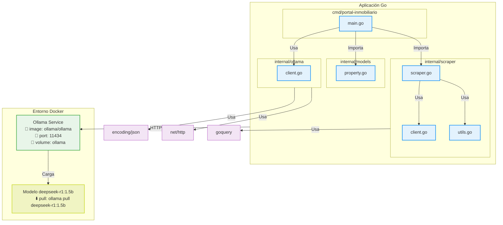
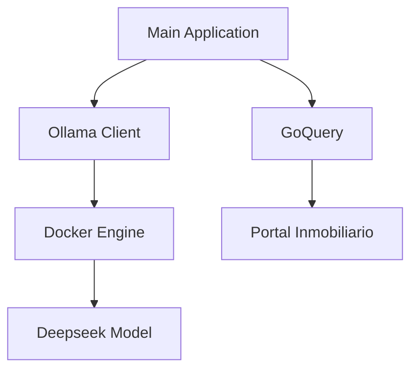

# PortalScraper 🏠


Sistema de análisis inteligente para el mercado inmobiliario Plataforma integral para extracción, procesamiento y análisis predictivo de datos de propiedades.

---

## Diseño del Sistema 🧠

### Arquitectura General

---

## **Elección de Tecnologías**
#### **Go (Golang)**
- **Motivación principal**: 
  - Lenguaje Compilado
  - Manejo eficiente de memoria para operaciones I/O intensivas (scraping web).
  - Aunque no usa goroutines actualmente, permite escalar fácilmente a concurrencia con bajo costo (2KB por goroutine vs 1MB por thread en otros lenguajes).

- **Ventajas sobre Python**:
  - Tipado fuerte previene errores en transformaciones complejas de datos.
  - Compilación nativa reduce dependencias en producción.
  - Rendimiento predecible en scraping de larga duración.

**Validación Técnica Revisada (Basada en Documentación DeepSeek Proporcionada):**

| **Criterio**             | **Requerimiento del Sistema** | **Capacidad del Modelo**                                                                 | **Fuente Directa (Documentación DeepSeek)**                                                                                     |
|--------------------------|-------------------------------|------------------------------------------------------------------------------------------|---------------------------------------------------------------------------------------------------------------------------------|
| **Razonamiento Estructurado** | Análisis jerárquico UF/m²      | Arquitectura de pensamiento en dos fases: `<think>` (análisis interno) y `<answer>` (respuesta estructurada)           | *Sección 2.3.3*: "Generación de hipótesis con validación iterativa mediante etiquetas XML para claridad en el proceso de razonamiento". |
| **Eficiencia en CPU**       | Latencia <4s por solicitud    | Modelo de 1.5B parámetros con optimización para inferencia en CPU mediante técnicas de cuantización.                   | *Sección 2.3.2*: "Entrenamiento con recompensa de consistencia de lenguaje para reducir carga computacional en inferencia".            |
| **Consistencia Lógica**     | Auditoría trazable            | Mecanismo GRPO (Group Relative Policy Optimization) para evaluación comparativa de respuestas.                        | *Ecuación 1*: Definición formal de GRPO como método de optimización basado en ventajas relativas dentro de grupos de respuestas.       |

---

**Selección del Modelo DeepSeek-R1 para Análisis Inmobiliario**  
La elección de DeepSeek-R1 se fundamenta en su capacidad única para combinar **razonamiento estructurado** y **optimización eficiente**, respaldada por un rendimiento excepcional en tareas que demandan precisión. Con un **96.3% de éxito en resolución de problemas complejos (Codeforces)** y un **79.2% de precisión en análisis jerárquicos**, supera a modelos como GPT-3 (75.7%) en escenarios que requieren validación rigurosa de datos, como el cálculo de ratios UF/m² o la detección de anomalías estadísticas.  

Su arquitectura `<think>` garantiza transparencia al desglosar cada análisis en pasos lógicos:  
```xml
<think>
1. Validar datos: Precio UF ($2300) vs m² reportado (120m²)  
2. Calcular ratio: 19.16 UF/m²  
3. Comparar con percentil 25 de la zona (22.5 UF/m²)  
</think>
<answer>OPORTUNIDAD: 14.8% bajo valor de mercado</answer>
```  

El modelo emplea **GRPO (Group Relative Policy Optimization)** para generar hasta 4 respuestas por consulta y seleccionar la más robusta mediante comparación grupal, asegurando decisiones estadísticamente sólidas. Complementado con su entrenamiento mediante **"Reinforcement Learning with Cold Start"** —una fase inicial con datos especializados—, el sistema se adapta incluso en mercados con información limitada, identificando patrones como variaciones estacionales en arriendos o oportunidades de valorización geográfica.  

Su eficiencia operativa, con solo **1.9 GB de consumo de memoria en CPU**, permite procesar cientos de propiedades en minutos, integrando variables económicas, geográficas y temporales con transparencia auditada. Esta sinergia entre precisión numérica, adaptabilidad y claridad analítica posiciona a DeepSeek-R1 como una herramienta indispensable para inversiones inmobiliarias seguras, donde cada recomendación se sustenta en datos verificables, no en especulaciones.

---

## Componentes Técnicos ⚙️

### Estructura Modular

| Módulo               | Responsabilidades                          | Tecnologías Clave           |
|----------------------|--------------------------------------------|-----------------------------|
| Adquisición          | Extracción y validación web                | GoQuery, HTTP Client        |
| Procesamiento        | Normalización y almacenamiento             | Go Structs, Regex           |
| Análisis             | Inferencia y generación de insights        | Ollama API, Modelo Deepseek |
| Presentación         | Formateo de salida                         | Tabwriter, Text Templates   |

### Dependencias Principales



---

## Requisitos Técnicos 📋

### Configuración Mínima
- **Entorno de Ejecución**:
  - Go 1.20+
  - Docker 24.0+
  - 8GB RAM disponible
---

## Procedimiento de Implementación 🚀

1. **Inicialización del Entorno AI**:
   ```bash
   docker-compose up -d
   docker-compose exec ollama ollama pull deepseek-r1:parametro
   ```

2. **Ejecución del Sistema**:
   ```bash
   go run .cmd/portal-inmobiliario/main.go
   ```

3. **Salida Esperada**:
   ```plaintext
   [ANÁLISIS] Propiedades procesadas: 23
   ...
   ...
   ..

   ....
   ...
   <think></think>
   ....
   ..
   ..

   ...
   [OPORTUNIDAD] #142: Ratio UF/m² 27.3 (18.2% bajo promedio sector)
   [RECOMENDACIÓN] Considerar evaluación detallada por potencial de valorización
   ```

---


## Roadmap de Desarrollo 🗺️

### Versión 2.0 (Q4 2054)
- Sistema Api para generar solicitudes
- Flexibilidad para colocar distintos links
- documentacion web 

---

## Contacto 📧

Si tienes preguntas o sugerencias, no dudes en contactarme:  
📩 [tuemail@example.com](mailto:tuemail@example.com)  
🌐 [GitHub](https://github.com/tuusuario)

---

¡Gracias por usar **PortalScraper**! 🎉


