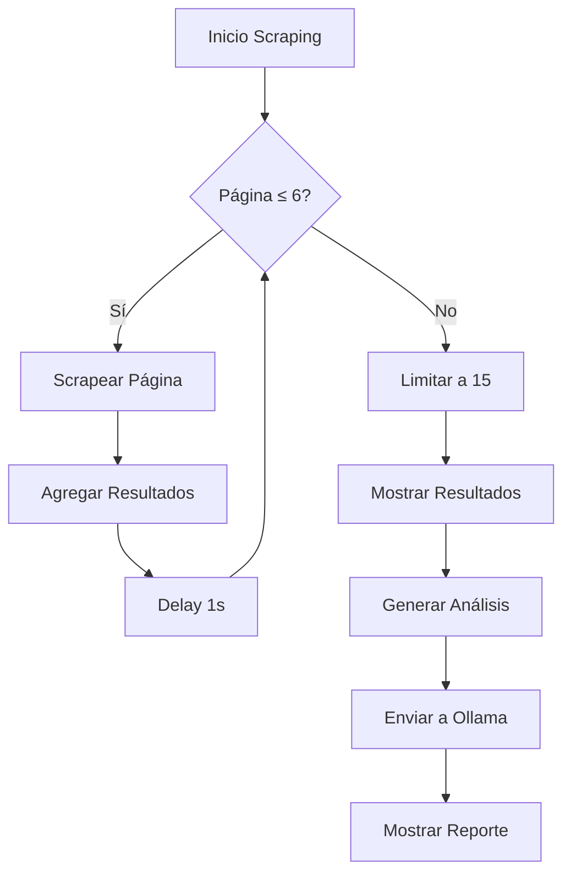

## Visión General

Este código realiza web scraping de propiedades inmobiliarias y analiza oportunidades de inversión calculando el ratio UF por metro cuadrado.

## Estructura Principal (`main.go`)

### 1. Configuración Inicial

```go
baseURL := "https://www.portalinmobiliario.com/venta/casa/propiedades-usadas/las-condes-metropolitana"
maxPages := 6
results := make([]models.Property, 0)
```

- **Objetivo**: Define parámetros iniciales para el scraping
- **Detalles Técnicos**:
  - `baseURL`: Sitio objetivo para scraping
  - `maxPages`: Límite de páginas a scrapear (6)
  - `results`: Slice para almacenar propiedades encontradas

### 2. Scraping Rápido

```go
for page := 1; page <= maxPages; page++ {
    // Lógica de scraping...
}
```

- **Flujo**:

  1. Construye URLs con paginación (`_PAGE=%d`)
  2. Usa `scraper.MainPage()` para obtener propiedades
  3. Maneja errores con registro detallado
  4. Añade delay de 1 segundo entre requests

- **Optimización**:
  - Limita resultados a 15 propiedades para pruebas

  ```go
  if len(results) > 15 {
      results = results[:15]
  }
  ```

### 3. Análisis con IA

```go
client := ollama.NewClient()
prompt := construirPromptCompacto(results)
respuesta, err := client.Generate(prompt)
```

- **Flujo de Análisis**:
  1. Construye prompt estructurado con datos
  2. Envía a modelo de lenguaje via Ollama
  3. Muestra resultados formateados

---

## Funciones Clave

### `construirPromptCompacto()`

**Propósito**: Crear instrucciones estructuradas para el modelo de IA

**Estructura del Prompt**:

1. Instrucciones de cálculo
2. Tabla de datos formateada
3. Requerimientos de salida

```markdown
Ejemplo de Tabla Generada:
| # | Propiedad | UF | m² | UF/m² |
|---|---|---|---|---|
| 1 | 26800 | 120 | 223.33 |
| 2 | 18500 | 85 | 217.65 |
```

### `extraerValorUF()` y `extraerValorM2()`

**Propósito**: Extraer valores numéricos de strings usando expresiones regulares

**Técnica**:

```go
// Extrae UF26.8 → 26800 (int)
re := regexp.MustCompile(`UF(\d+\.?\d*)`)

// Extrae 120 m² → 120 (int)
re := regexp.MustCompile(`(\d+)\s*m²`)
```

**Conversión**:

- Multiplica UF por 1000 para mantener decimales
- `ParseFloat` → `int` para facilitar cálculos

---

## Consideraciones Importantes

1. **Limitaciones de Scraping**:

   - Delay de 1 segundo entre requests
   - Máximo 6 páginas scrapeadas
   - Cortar resultados a 15 propiedades en pruebas

2. **Manejo de Errores**:

   - Registra errores por página sin detener proceso
   - Error crítico solo en fallo de generación de análisis

3. **Seguridad de Datos**:

   - Valida existencia de valores antes de cálculos

   ```go
   if uf > 0 && m2 > 0 {
       ratio = fmt.Sprintf("%.2f", float64(uf)/float64(m2))
   } else {
       ratio = "N/A"
   }
   ```

4. **Nota sobre el Formato**:
   - La tabla generada actualmente muestra UF en lugar del nombre de la propiedad
   - _Posible mejora_: Incluir `prop.Title` en la columna "Propiedad"

---

## Flujo de Datos



---

## Uso de Modelo de Lenguaje

**Estrategia de Prompt**:

1. Instrucciones claras y específicas
2. Formato tabla markdown para datos estructurados
3. Ejemplo de salida esperada

**Ejemplo de Salida Esperada**:

```
Oportunidades detectadas:
1. Casa Centro - UF/m²: 210.50 (Menor ratio zona centro)
2. Departamento Costero - UF/m²: 215.00 (Precio bajo promedio playa)
3. Loft Moderno - UF/m²: 220.25 (Única con amenities)

Análisis comparativo: Los ratios más bajos...
```
