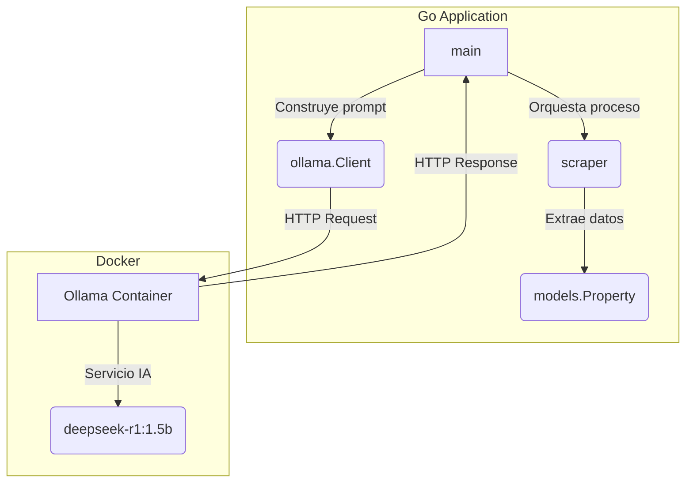
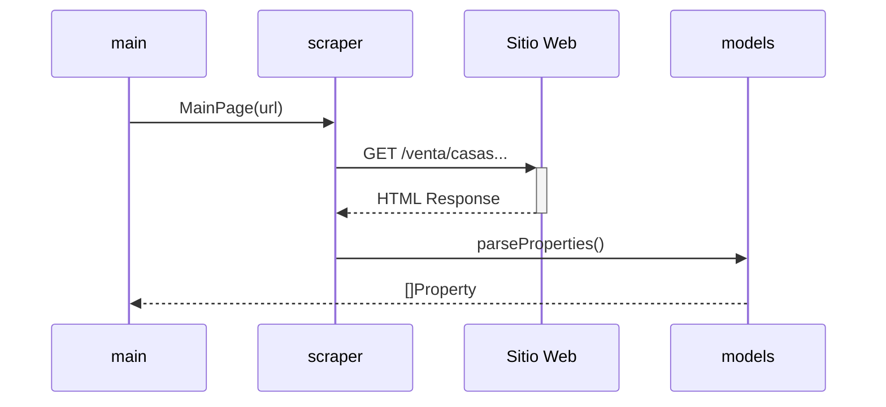
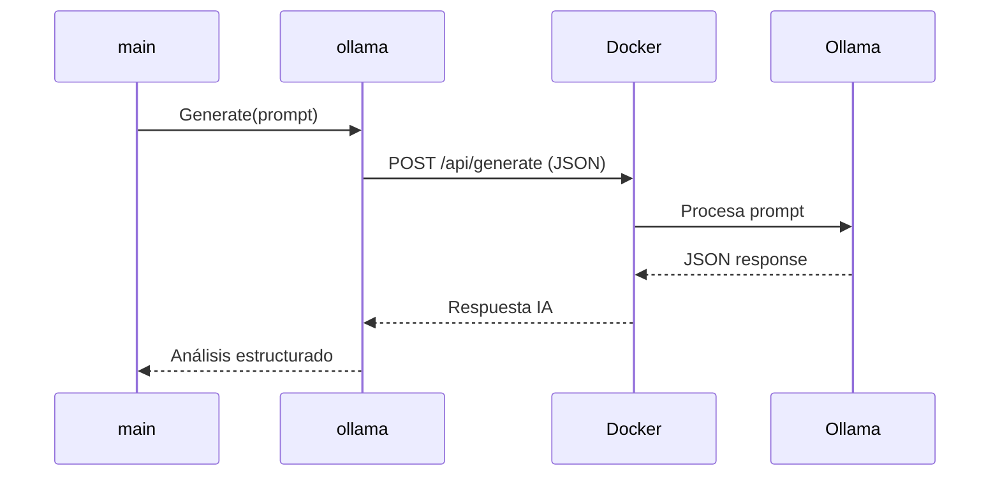

# Diagrama del Sistema y Flujo Integral

## Arquitectura del Sistema



---

## Componentes Clave

### 1. Módulo Go (Aplicación Principal)

| Componente  | Función                                                | Interacción                              |
| ----------- | ------------------------------------------------------ | ---------------------------------------- |
| **scraper** | - Realiza scraping HTML<br>- Limpia datos crudos       | Recibe URLs → Devuelve []models.Property |
| **models**  | - Define estructura de datos<br>- Almacena propiedades | Base para todo el flujo de datos         |
| **ollama**  | - Cliente HTTP para IA<br>- Maneja prompts/respuestas  | Convierte datos → Análisis estructurado  |
| **main**    | - Coordina flujo completo<br>- Interfaz con usuario    | Inicia scraping → Muestra resultados     |

### 2. Docker (Infraestructura IA)

| Componente         | Función                                              | Detalles Técnicos                         |
| ------------------ | ---------------------------------------------------- | ----------------------------------------- |
| **Ollama Service** | - Host del modelo de lenguaje<br>- Procesamiento NLP | Puerto: 11434<br>Modelo: deepseek-r1:1.5b |
| **API REST**       | - Comunicación HTTP<br>- Formato JSON                | Endpoint: `/api/generate`                 |

---

## Flujo Detallado del Sistema

### Paso 1: Scraping Inicial



### Paso 2: Preparación de Datos

```go
// main.go
prompt := construirPromptCompacto(results)
// Truncamiento seguro
if len(prompt) > 2100 {
    prompt = prompt[:2100] + "... [TRUNCADO]"
}
```

### Paso 3: Análisis con IA



### Paso 4: Presentación de Resultados

```bash
# Salida típica
📊 Análisis generado:
Oportunidades detectadas:
1. Casa Centro - UF/m²: 210.50 (Precio bajo promedio zona)
2. Dpto. Vista Montaña - UF/m²: 215.00 (Único con amenities)
3. Loft Moderno - UF/m²: 220.25 (Mínimo histórico)

Análisis comparativo: Los ratios más bajos...
```

---

## Puntos de Integración Críticos

| Componentes          | Protocolo | Detalles                                                                         |
| -------------------- | --------- | -------------------------------------------------------------------------------- |
| scraper ↔ Sitio Web | HTTP/HTML | - User-Agent realista<br>- Timeout 10s<br>- Selectores CSS actualizables         |
| main ↔ ollama       | Go Native | - Prompt truncado a 2100 chars<br>- Formato tabla Markdown en prompt             |
| ollama ↔ Docker     | HTTP/REST | - Modelo pre-instalado<br>- Timeout 5 minutos<br>- Manejo de errores de conexión |

---

## Dependencias Externas

1. **Servicio Ollama en Docker**

   ```bash
   # Comando requerido para iniciar
   docker run -d -p 11434:11434 ollama/ollama
   ollama pull deepseek-r1:1.5b
   ```

2. **Estructura HTML Constante**

   - Selectores CSS específicos del portal
   - Formato de precios/m² consistente

3. **Configuración de Red**
   - Puerto 11434 accesible localmente
   - Sin firewall bloqueando conexiones locales

---

## Escenarios de Error y Recuperación

| Error                    | Detección                          | Acción Correctiva                                       |
| ------------------------ | ---------------------------------- | ------------------------------------------------------- |
| **HTML cambiado**        | Selectores devuelven 0 propiedades | Actualizar selectores CSS en scraper.go                 |
| **Ollama no responde**   | Timeout después de 5 minutos       | Reiniciar contenedor: `docker-compose restart ollama`   |
| **Prompt inválido**      | IA devuelve análisis incoherente   | Verificar formato de tabla en construirPromptCompacto() |
| **Bloqueo por scraping** | HTTP 403/429                       | Rotar User-Agents, añadir delays mayores                |

---

Esta arquitectura permite una solución escalable donde:

1. **Go** maneja eficientemente tareas intensivas (scraping, procesamiento)
2. **Docker** aisla el modelo de IA y su entorno
3. La **comunicación HTTP** garantiza interoperabilidad
4. Los **paquetes modulares** facilitan mantenimiento y actualizaciones
