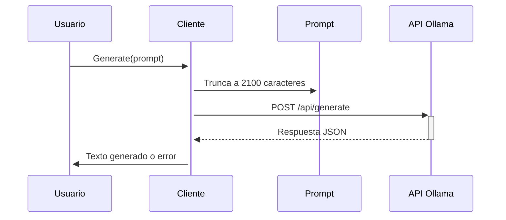

## Visión General

Cliente para interactuar con el modelo de lenguaje Ollama local. Se encarga de enviar prompts y recibir respuestas generadas por IA.

---

## Configuración Básica

### Constantes Clave

```go
const (
    OLLAMA_ENDPOINT = "http://localhost:11434/api/generate" // Endpoint local
    MODEL_NAME      = "deepseek-r1:1.5b"  // Modelo específico de IA
    TIMEOUT         = 300 * time.Second   // 5 minutos máximo por solicitud
)
```

| Constante         | Valor            | Propósito                             |
| ----------------- | ---------------- | ------------------------------------- |
| `OLLAMA_ENDPOINT` | URL local        | Punto de conexión de la API Ollama    |
| `MODEL_NAME`      | deepseek-r1:1.5b | Modelo de lenguaje específico a usar  |
| `TIMEOUT`         | 5 minutos        | Tiempo máximo de espera por respuesta |

---

## Estructuras Principales

### Client

```go
type Client struct {
    httpClient *http.Client // Cliente HTTP configurado
}
```

- **Propósito**: Mantener la configuración de conexión
- **Característica**: Incluye timeout de 5 minutos

### GenerateRequest

```go
type GenerateRequest struct {
    Model  string `json:"model"`  // Nombre modelo
    Prompt string `json:"prompt"` // Texto de entrada
    Stream bool   `json:"stream"` // Siempre false
}
```

- **Uso**: Estructura para solicitud a la API
- **Formato**: JSON compatible con Ollama

### GenerateResponse

```go
type GenerateResponse struct {
    Response string `json:"response"` // Texto generado
}
```

- **Contenido**: Respuesta cruda del modelo

---

## Flujo de Trabajo



---

## Funcionalidad Clave: Generate()

### Parámetros

- `prompt string`: Texto de entrada para el modelo

### Proceso Interno

1. **Limitación de Prompt**

   ```go
   if len(prompt) > 2100 {
       prompt = prompt[:2100] + "... [TRUNCADO]"
   }
   ```

   - Corta prompts muy largos para evitar sobrecarga

2. **Construcción de Solicitud**

   ```go
   requestBody := GenerateRequest{
       Model:  MODEL_NAME,
       Prompt: prompt,
       Stream: false, // Respuesta completa
   }
   ```

3. **Envío HTTP**

   - Método: POST
   - Content-Type: application/json
   - Timeout: 5 minutos

4. **Manejo de Errores**

   - Conexión fallida: Sugiere reiniciar servicio

   ```go
   "Ejecuta: docker-compose restart ollama"
   ```

   - Códigos HTTP no 200: Devuelve cuerpo del error
   - Decodificación fallida: Notifica error de formato

5. **Procesamiento de Respuesta**
   - Extrae campo `response` del JSON
   - Devuelve texto limpio (sin formato adicional)

---

## Detalles Técnicos Relevantes

1. **Configuración HTTP**

   ```go
   httpClient: &http.Client{
       Timeout: TIMEOUT, // 5 minutos timeout
   }
   ```

   - Timeout ajustado para modelos grandes

2. **Seguridad en Datos**

   - Cierre seguro del body:

   ```go
   defer resp.Body.Close()
   ```

   - Lectura completa del body en errores

3. **Compatibilidad de Modelo**
   - Requiere tener instalado el modelo específico:
   ```bash
   ollama pull deepseek-r1:1.5b
   ```

---

## Ejemplo de Uzo

```go
client := ollama.NewClient()
respuesta, err := client.Generate("Analiza estos datos...")
if err != nil {
    // Manejar error
}
fmt.Println(respuesta)
```

---

## Dependencias y Requisitos

1. **Servicio Ollama en ejecución**

   - Debe estar accesible en `localhost:11434`
   - Requiere configuración previa del modelo

2. **Entorno Docker (sugerido)**
   - Error común: Servicio no iniciado
   - Solución sugerida en código:
   ```bash
   docker-compose restart ollama
   ```

---

Esta implementación provee una interfaz segura y configurable para interactuar con modelos de lenguaje locales via Ollama, optimizada para análisis de datos estructurados
