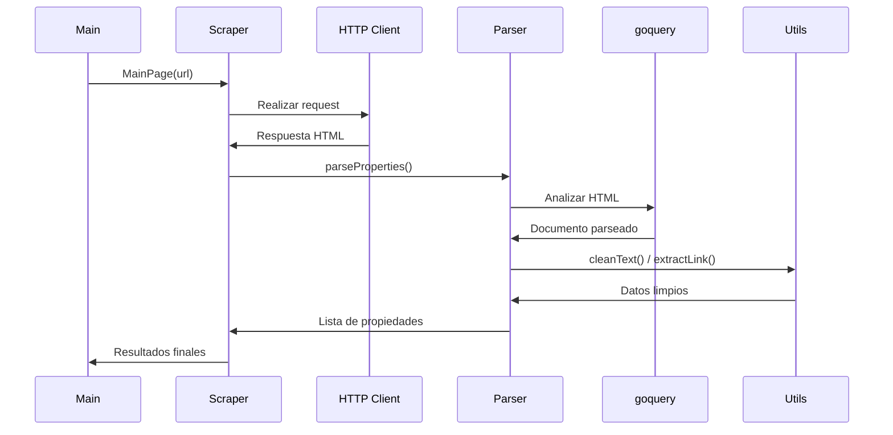

## Estructura de Archivos

```bash
scraper/
├── client.go    # Configuración HTTP
├── scraper.go   # Lógica principal de scraping
└── utils.go     # Funciones auxiliares
```

---

## 1. client.go - Configuración HTTP

```go
package scraper

import (
    "net/http"
    "time"
)

var Client = &http.Client{
    Timeout: 10 * time.Second,
    Transport: &http.Transport{
        DisableKeepAlives: true,
    },
}
```

### Propósito:

Configuración global del cliente HTTP para todas las solicitudes de scraping.

| Parámetro           | Valor | Explicación                                      |
| ------------------- | ----- | ------------------------------------------------ |
| `Timeout`           | 10s   | Tiempo máximo de espera por respuesta            |
| `DisableKeepAlives` | true  | Desactiva conexiones persistentes entre requests |

**Efectos prácticos:**

- Previene bloqueos por múltiples conexiones
- Reduce huella de memoria en scraping intensivo
- Mitiga detección como bot

---

## 2. scraper.go - Lógica Principal

### Función MainPage

```go
func MainPage(url string) ([]models.Property, error) {
    // Configura request con User-Agent real
    req, _ := http.NewRequest("GET", url, nil)
    req.Header.Set("User-Agent", "Mozilla/5.0 (Windows NT 10.0; Win64; x64)...")

    // Ejecuta request
    res, err := Client.Do(req)
    if err != nil {
        return nil, err
    }
    defer res.Body.Close()

    // Verifica respuesta
    if res.StatusCode != 200 {
        return nil, fmt.Errorf("status code error: %d %s", res.StatusCode, res.Status)
    }

    return parseProperties(res)
}
```

**Flujo:**

1. Prepara solicitud con headers de navegador real
2. Ejecuta solicitud usando cliente configurado
3. Valida éxito de respuesta (HTTP 200)
4. Delega análisis de HTML

### Función parseProperties

```go
func parseProperties(res *http.Response) ([]models.Property, error) {
    doc, err := goquery.NewDocumentFromReader(res.Body)
    if err != nil {
        return nil, err
    }

    var properties []models.Property

    doc.Find("li.ui-search-layout__item").Each(func(i int, s *goquery.Selection) {
        // Extracción de datos
        priceSymbol := cleanText(s.Find(".andes-money-amount__currency-symbol").First().Text())
        priceAmount := cleanText(s.Find(".andes-money-amount__fraction").First().Text())

        prop := models.Property{
            Title:    cleanText(s.Find(".poly-component__title-wrapper").Text()),
            Price:    priceSymbol + priceAmount,
            Location: cleanText(s.Find(".poly-component__location").Text()),
            Link:     extractLink(s),
        }

        // Manejo de atributos numéricos
        attributes := s.Find(".poly-attributes-list__item.poly-attributes-list__separator")
        if attributes.Length() >= 3 {
            prop.Bedrooms = cleanText(attributes.Eq(0).Text())
            prop.Bathrooms = cleanText(attributes.Eq(1).Text())
            prop.M2 = cleanText(attributes.Eq(2).Text())
        }

        properties = append(properties, prop)
    })

    return properties, nil
}
```

**Selectores Clave:**
| Elemento | Selector CSS |
|----------|--------------|
| Contenedor propiedad | `li.ui-search-layout__item` |
| Precio | `.andes-money-amount__currency-symbol` + `.andes-money-amount__fraction` |
| Título | `.poly-component__title-wrapper` |
| Ubicación | `.poly-component__location` |
| Atributos | `.poly-attributes-list__item.poly-attributes-list__separator` |

---

## 3. utils.go - Funciones Auxiliares

### cleanText

```go
func cleanText(text string) string {
    return strings.TrimSpace(strings.ReplaceAll(text, "\n", ""))
}
```

**Transformaciones:**

1. Elimina saltos de línea (`\n`)
2. Remueve espacios al inicio/final
3. Ejemplo: `"\n   Casa 3D  \n"` → `"Casa 3D"`

### extractLink

```go
func extractLink(s *goquery.Selection) string {
    link, exists := s.Find("a.poly-component__title").Attr("href")
    if !exists {
        return ""
    }
    return link
}
```

**Comportamiento:**

- Busca el atributo `href` en enlaces específicos
- Retorna cadena vacía si no encuentra el enlace
- Ejemplo: Extrae `"/MLC-123456-casa"` → URL completa

---

## Diagrama de Flujo



---

## Consideraciones Técnicas

1. **Estabilidad del scraping**

   - Depende de la estructura HTML del sitio
   - Selectores CSS deben actualizarse si cambia el diseño

2. **Manejo de datos incompletos**

   - Campos numéricos pueden faltar

   ```go
   if attributes.Length() >= 3 { ... }
   ```

3. **Rendimiento HTTP**

   - Timeout agresivo (10s) previene bloqueos
   - `DisableKeepAlives` mejora seguridad pero reduce eficiencia

4. **Evasión de bloqueos**
   - User-Agent realista
   - Delay entre requests manejado externamente

---

Esta implementación provee una solución completa para extraer datos estructurados de propiedades inmobiliarias, transformando HTML crudo en información útil para análisis posterior.
